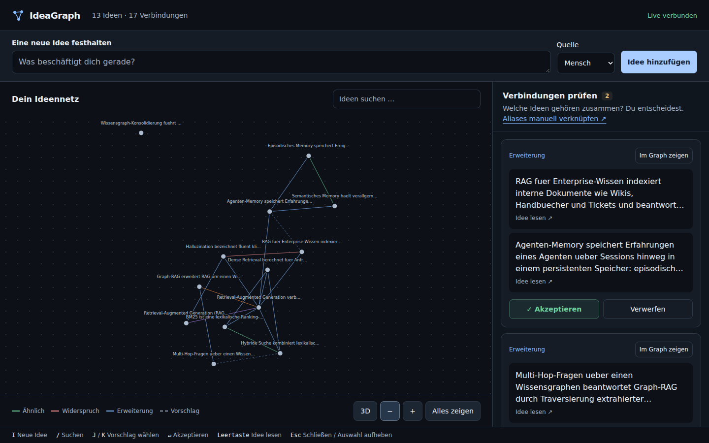

# IdeaGraph Live Engine 🕸️

**Self-growing idea graph: Ingest → Embed → Suggest → Visualize**

A generic engine for a persistent knowledge graph of ideas. The memory is
**your own private git repo** (the "brain") — the engine is decoupled from
the brain and points to your clone via `IG_BRAIN_PATH`. No hardcoded remote,
no private data in the code: open-source ready.

## Web UI (tabbed cockpit)

Start the server, open the URL, and you get a cockpit with three tabs:

| Tab | Purpose |
|---|---|
| **Ingest** (start) | Capture new ideas/notes (selectable source), duplicate merge, status |
| **Graph** | d3 force graph with zoom/pan (Obsidian-like): scroll = zoom, drag = pan, hover = tooltip, click = details, double-click = focus (highlight neighbors), search = center |
| **Review** | Accept/reject pending edge suggestions + `same_as` picker |

Keyboard: `1/2/3` tabs · `i` ingest · `Space` node text · `Esc` close ·
`j/k/Enter` review navigation.

```
uvicorn ideagraph.server:app --host 127.0.0.1 --port 8000   # → http://localhost:8000
```



## Architecture

```
┌──────────────┐   git commit+push   ┌────────────────────┐   git pull   ┌─────────────────┐
│ your agent   │ ──────────────────▶ │ your brain repo    │ ◀──────────▶ │ Live Engine     │
│ (CLI/API)    │   (knowledge, learned) │ (private, Markdown)│  (sync)      │ Ingest→Embed→   │
└──────────────┘                     └────────────────────┘              Suggest→Viz+HITL │
                                                                          └─────────────────┘
```

- **Nodes** = one Markdown file per idea (`nodes/<id>.md`, YAML frontmatter
  with `type: semantic|episodic|procedural`, `status: probation|active|tombstone`,
  `sources:` logs merged duplicate ingests)
- **Edges** = `edges.jsonl` (typed: `ähnlich`/similar, `erweitert`/extends,
  `kontradiktorisch`/contradicts, `supersedes`, `continues`, `same_as`;
  bi-temporal: `valid_from`/`valid_to` — invalidation instead of deletion;
  confidence + provenance)
- **vectors.jsonl** = embedding cache (only new nodes get embedded)
- **INDEX.md** = generated table of contents
- Every ingest is a commit — the graph grows as visible history.

## Features (Roadmap V2, implemented)

- **Confidence + auto-accept band** — similarity edges ≥ 0.95 are accepted
  directly, otherwise pending (HITL); `IDEAGRAPH_AUTO_ACCEPT=1` forces it.
- **Hybrid retrieval** — dense + BM25 via RRF fusion (`ig search`).
- **Intent edges (V2#3)** — automatically detected intentions `supersedes` /
  `continues` / `kontradiktorisch` via marker heuristic. Safety gate: only
  when real ST cosine ≥ 0.45 (prevents false positives in homogeneous corpora).
  Auto-accepted by default; switchable to pending (HITL) via
  `IDEAGRAPH_INTENT_PENDING=1`.
- **Memory hygiene (V2#2)** — dual buffer: new nodes start in `probation`,
  promoted to `active` or `tombstone` after dedup verification (graceful
  degradation, never hard-deleted); Weibull decay.
- **Cross-encoder rerank pass (V2#1)** — optional second retrieval stage over
  the top-K candidates; enabled via `IDEAGRAPH_RERANKER` (off by default,
  no new hard dependency).
- **Admit-rule (V2#3)** — opt-in governance: with
  `consolidate(admit_required=True)`, a node without relations stays in
  `probation` instead of being promoted.
- **Snapshot persistence** — every ingest is a git commit; bi-temporal edges
  + provenance (`invalidated_by`).

## CLI

```bash
ig ingest "New idea ..."            # ingest (duplicates are merged)
cat note.md | ig ingest -           # from file/stdin
ig pending                          # open edge suggestions
ig accept <edge_id>                 # accept a suggestion
ig reject <edge_id>                 # reject a suggestion
ig link <node_a> <node_b>           # manual edge (default: same_as)
ig search "attention"               # hybrid search (dense + BM25)
```

## Edge types

| Type | Creation | Meaning |
|---|---|---|
| `ähnlich` (similar) | automatic (sim ≥ 0.75) | essentially the same idea |
| `erweitert` (extends) | automatic (0.45–0.75) | thematically related, builds on |
| `supersedes` | intent (marker + sim ≥ 0.45) | new makes old obsolete |
| `continues` | intent (marker + sim ≥ 0.45) | continues / builds on |
| `kontradiktorisch` (contradicts) | intent / manual | contradicts |
| `same_as` | manual only (`ig link`) | translation/alias pair |

## Dedupe

Near-duplicate ingests (cosine ≥ 0.92 on normalized text) are **merged
instead of creating a new node**: the source is added under `sources:` in the
frontmatter, the commit says `ingest dup of …`. Opt-out: `allow_duplicates: true`.

## Node types

| Type | Meaning | Examples |
|---|---|---|
| `semantic` | facts, ideas, concepts (default) | papers, project notes |
| `episodic` | events, session logs | "subagent X ran Y today" |
| `procedural` | skills, reusable procedures | "how to ingest research" |

## Quickstart

```bash
# 1) clone your own brain repo once (remote only needed here):
git clone <your-brain-repo> ~/ideagraph-brain

# 2) set up the engine (Python 3.10+)
python3 -m venv .venv
.venv/bin/pip install -e ".[dev]"

# 3) start the server
#   demo without model download:  IDEAGRAPH_EMBEDDER=hash uvicorn ideagraph.server:app --host 127.0.0.1 --port 8000
#   real (loads all-MiniLM-L6-v2): uvicorn ideagraph.server:app --host 127.0.0.1 --port 8000

# 4) CLI ingest
ig ingest "New idea ..."
# → http://localhost:8000 — Ingest/Graph/Review tabs
```

### Environment variables

| Variable | Default | Meaning |
|---|---|---|
| `IG_BRAIN_PATH` | `~/ideagraph-brain` | path to the brain clone |
| `IG_BRAIN_REMOTE` | *(none)* | only needed for `git clone` on first setup; existing clones use their own origin |
| `IG_BRAIN_MODE` | `git` | `local` = filesystem only (tests) |
| `IDEAGRAPH_EMBEDDER` | `st` | `hash` = deterministic test embedder |
| `IDEAGRAPH_AUTO_ACCEPT` | off | `1` = edges accepted automatically (no HITL) |
| `IDEAGRAPH_INTENT_PENDING` | off | `1` = intent edges (supersedes/continues/contradicts) become pending (HITL review) instead of auto-accepted |
| `IDEAGRAPH_RERANKER` | none | optional cross-encoder rerank pass (V2#1): `st` = sentence-transformers CrossEncoder, or a model name/path; off by default |
| `IG_BOT_NAME` | `ideagraph-bot` | git commit author (name) |
| `IG_BOT_EMAIL` | `bot@ideagraph.local` | git commit author (email) |

## Tests

```bash
.venv/bin/python -m pytest tests/ -q
```

82 tests — similarity, edge suggestion, intent, dedupe, memory hygiene,
Markdown round-trip, brain FS, retrieval, evals (golden set).

## Open source / privacy

The **engine is generic** (public repo) — the **brain is your private repo**
with your data. The engine contains no brain data.

## Status

In development. Core features (UI, V2, OSS readiness) are implemented;
release `v0.2.0` is published.

## License

MIT — see `LICENSE`.
